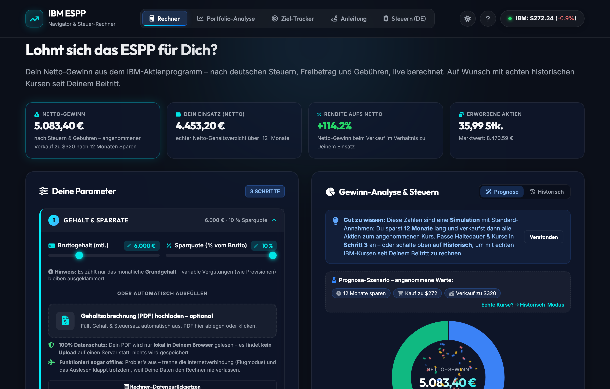
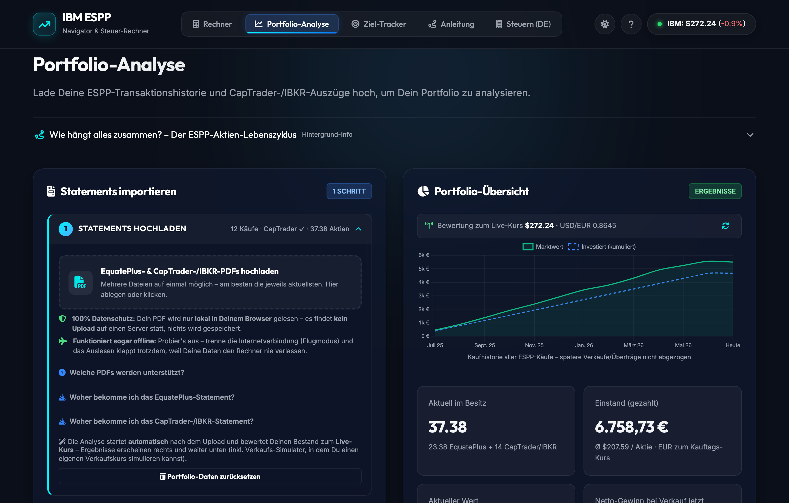
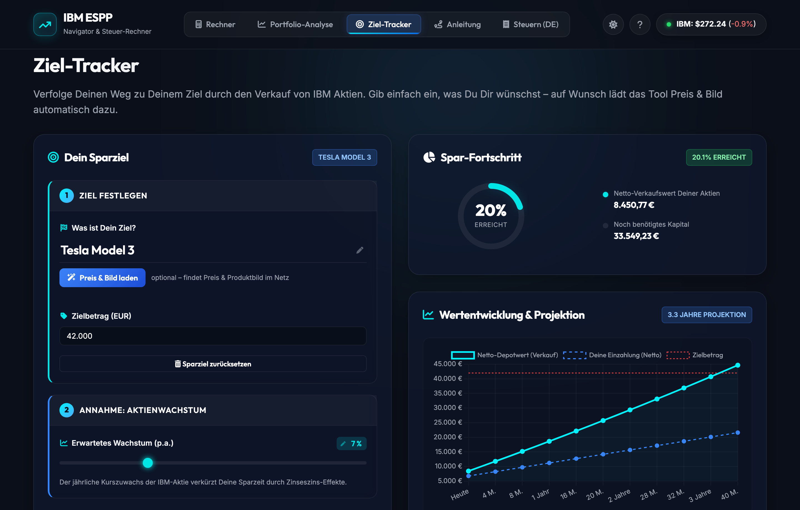
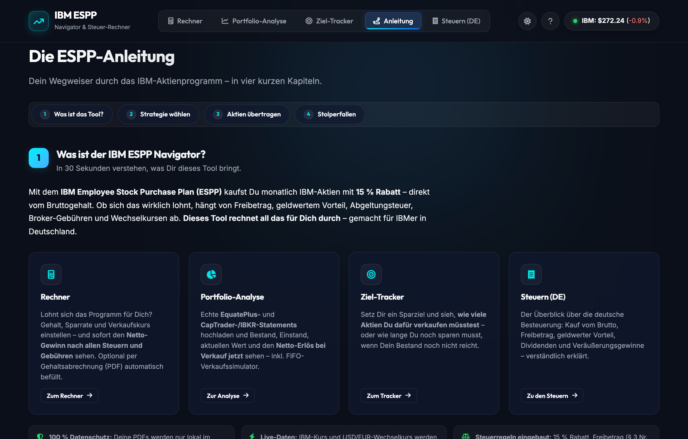
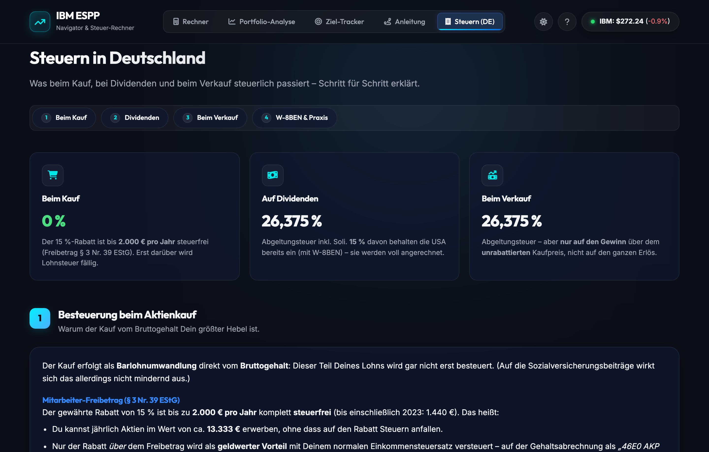
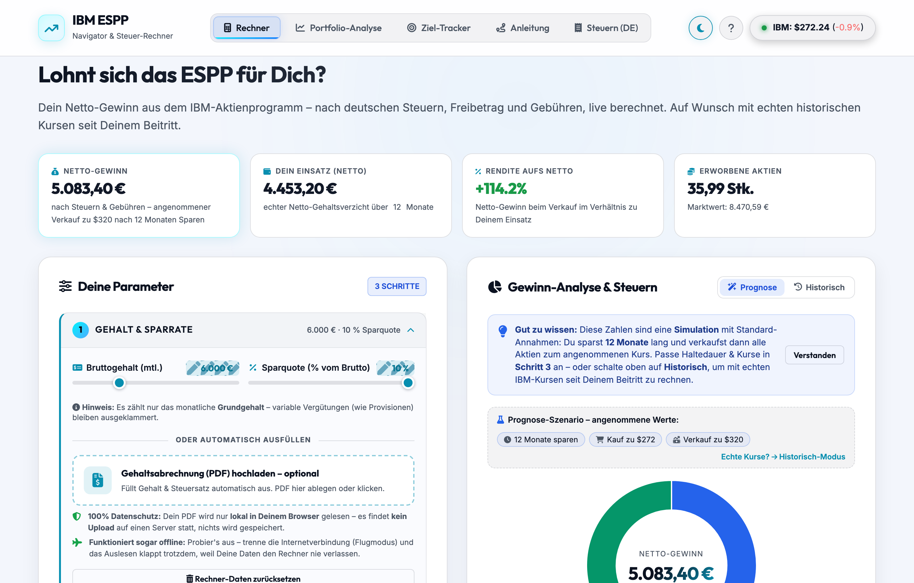

# IBM ESPP Navigator & Steuer-Rechner

A single-page web app that helps a **German IBM employee** make sense of their **Employee Stock
Purchase Plan (ESPP)** — model the economics of buying and selling, analyse the *real* portfolio from
uploaded broker statements, and track progress toward a savings goal — all with **correct German
taxation** built in.

The interface is in **German** (its audience is IBM employees in Germany), but the codebase and this
document are in English.

> 🔒 **Privacy first.** Every statement and payslip you upload is parsed **entirely in your browser**.
> Nothing is uploaded to or stored on a server — you can even disconnect from the internet and the
> PDF parsing still works.



---

## What is this?

With the IBM ESPP, employees buy IBM shares every month at a **15 % discount**, straight from their
gross salary. Whether that actually pays off depends on a tangle of German tax rules — the tax-free
allowance (§ 3 Nr. 39 EStG), the taxable benefit on the discount, capital-gains tax (Abgeltungsteuer),
church tax, broker fees and USD/EUR exchange rates.

This tool does all of that maths for you, and goes further: it reads your **real EquatePlus and
CapTrader/IBKR statements** to show what you actually hold and what you'd net if you sold today, and it
helps you decide *how* to sell (the recommended transfer-to-a-cheap-broker route vs. the expensive
direct sale).

It is a community/personal project and **not affiliated with or endorsed by IBM**.

---

## Features

The app is organised into five tabs.

### 🧮 Rechner — "is the ESPP worth it for me?"

A forward calculator. Enter your salary, savings rate, tax profile, assumed sell price and holding
period, and see your **net profit after all German taxes and fees**, broken down step by step in a
chart-first layout. Two modes:

- **Prognose** — simulate with your own assumptions.
- **Historisch** — replay against the *real* monthly IBM prices and USD/EUR rates since your ESPP join
  date (data back to 1962).

Inputs can be auto-filled from an uploaded **payslip PDF** (parsed locally), and the marginal tax rate
is then roughly estimated for you.

### 📊 Portfolio-Analyse — your real holdings

Upload your **EquatePlus** and **CapTrader / Interactive Brokers (IBKR)** statements (PDF) to see your
actual position: shares held per platform, cost basis (converted at the FX rate on each purchase date,
per the German Anlage-KAP rule), current value, cash balance and net proceeds if sold now — plus a
**FIFO sell simulator**, a sortable buy/sell history and an **Anlage-KAP tax report** of realised sales.



### 🎯 Ziel-Tracker — savings-goal tracker

Set a savings goal — type an amount, or paste a product link / free-text search and let the tool fetch
the price and image. It then shows how many of your shares you'd need to sell to afford it (or how many
more you'd need, and how long that would take), with a projection chart.



### 🧭 Anleitung — how it all works

An overview of the tool, three strategies for handling your ESPP shares, and a step-by-step guide for
the **EquatePlus → CapTrader/IBKR transfer** (the key move for selling cheaply).



### 🧾 Steuern (DE) — the tax explainer

How the ESPP is taxed in Germany at every stage: the discount, the § 3 Nr. 39 EStG allowance,
dividends, capital gains, and the **W-8BEN** form for reduced US withholding.



### Built-in German tax logic

- **15 % ESPP discount** (`Marktwert = Beitrag ÷ 0.85`).
- **§ 3 Nr. 39 EStG allowance** — 2.000 €/yr (1.440 € up to 2023), applied per calendar year; the
  discount above it is taxed as wage income at your marginal rate.
- **Abgeltungsteuer** on capital gains — 26,375 % (church-tax aware: 27,8186 % / 27,9951 %), with
  **Günstigerprüfung**.
- **Broker comparison** including the German-broker "Steuer-Falle" (§ 43a Abs. 2 EStG —
  Ersatzbemessungsgrundlage on 30 % of gross proceeds, modelled as the worse of that vs. the real-gain
  tax).
- **Historical USD/EUR rate at the purchase date** for an accurate EUR cost basis.

### And a light theme 🌗

Toggle dark/light from the header.



---

## Tech stack

| Layer | Detail |
|-------|--------|
| **Backend** | Node.js + **Express** (`server.js`). The only runtime dependency is `express`; upstream calls (stock price, FX, product lookup) use Node's built-in `https`/`http` — no shell-outs. |
| **Frontend** | Vanilla **HTML / CSS / JS** in `public/` — no build step, no framework, no bundler. |
| **Charts** | **Chart.js** (donut, projection and value charts). |
| **Animations** | **GSAP** + ScrollTrigger (entrance choreography, counters, reveals). |
| **PDF parsing** | **pdf.js**, running **100 % client-side**. |
| **Icons & fonts** | **FontAwesome** + Inter / Outfit — self-hosted. |
| **Styling** | A dark/light "glassmorphism" design system in `style.css` driven by CSS custom properties. |

Every third-party asset is **vendored in `public/vendor/`** — there are **no CDNs and zero external
asset requests**, so the page loads and parses PDFs fully offline. The server is only a thin proxy for
*optional* live data; all personal/financial data stays in your browser.

### Backend API

All endpoints are small proxies (to dodge CORS / anti-bot) with an in-memory TTL cache and
stale-on-error fallback, so visitors don't hammer the upstreams.

| Endpoint | Purpose |
|----------|---------|
| `GET /api/stock` | Current price + EUR (header ticker). |
| `GET /api/stock/current` | Current price + USD/EUR rate (Portfolio tab). |
| `GET /api/stock/historical?months=` | Monthly average prices. |
| `GET /api/stock/historical-range` | Daily prices for a date range. |
| `GET /api/forex/historical-range` | Historical USD/EUR (purchase-date cost basis). |
| `GET /api/product?url=` | Product title/image/price extraction for any shop (JSON-LD → Open Graph → DOM fallbacks), behind an **SSRF guard** that validates every redirect hop and pins the connection to the checked IP. |
| `GET /api/resolve-goal?q=` | Free-text goal resolver via a self-hosted SearXNG instance. |

---

## Project structure

```
.
├── server.js              # Express server + cached API proxies (stock/FX, product lookup, SearXNG)
├── public/                # Frontend — served statically, no build step
│   ├── index.html         # Single page, five tabs + first-visit welcome modal
│   ├── app.js             # All client logic: calculator, PDF parsing, portfolio, goal tracker, charts
│   ├── style.css          # Dark/light glassmorphism design system
│   ├── favicon.svg
│   └── vendor/            # Self-hosted libs: pdf.js, Chart.js, GSAP+ScrollTrigger, FontAwesome, fonts
├── docs/screenshots/      # Images used in this README
├── Dockerfile             # node:20-alpine production image
├── docker-compose.yml
├── .dockerignore          # Keeps dev files and private statements out of the image
├── package.json           # express (runtime); pdf-parse + playwright are devDependencies only
├── DEPLOY.md              # Full deployment guide
└── README.md
```

---

## Run locally

No build step — the server serves `public/` as static files.

```bash
npm install
npm start          # or: npm run dev
```

Then open **http://localhost:3002**.

---

## Configuration

All optional, set via environment variables:

| Variable | Default | Purpose |
|----------|---------|---------|
| `PORT` | `3002` | HTTP port. |
| `STOCK_SYMBOL` | `IBM` | Ticker to track. |
| `SEARXNG_URL` | `http://192.168.178.157:8084` | A self-hosted [SearXNG](https://docs.searxng.org/) instance (JSON output enabled) for the Ziel-Tracker's free-text product search. |

There is **no telemetry or analytics** of any kind.

---

## Deploy

The app is containerised. See **[`DEPLOY.md`](DEPLOY.md)** for the full guide (image build,
`docker-compose.yml`, and a reverse-proxy snippet for public HTTPS).

```bash
docker compose up -d --build
```

---

## Privacy

- Statements and payslips you upload are parsed **locally in your browser** via pdf.js — they never
  reach the server, and nothing is persisted server-side (the server has no upload handling at all).
- Because every asset is self-hosted, the page makes **zero external requests** for its own code/fonts;
  the only network calls are the optional live-data proxies, which fail gracefully offline.
- This repository contains **no personal data**. Keep your own statements out of version control — the
  `.gitignore` excludes `payslips/`; never commit brokerage statements or their extracts.

---

## Disclaimer

This tool and its calculations are for **informational purposes only** and do **not** constitute
financial or tax advice. The figures are best-effort and may be wrong — verify anything important
yourself, and consult a tax advisor (Steuerberater) in case of doubt. Not affiliated with IBM,
EquatePlus, Computershare, CapTrader or Interactive Brokers.
